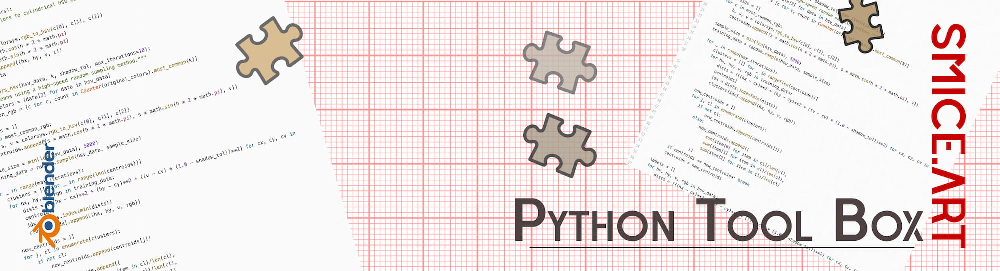

  

# Python Scripts Tool-Box
A collection of little helper tools, based on python for Blender.

## Documentation
There is no explicit documentation on this scripts.

| Object | Description | Preview |
| :--- | :--- | :--- |
| **[AUTO RENDER](./render%20material/)** | this script renders all material previews in the back . |
| **[AUTO RENAME](./rename%20material/)** | this script renames all material in a blend file |

## Release Notes

### v1.0.0 (July 26, 2026)
- **Publishing**: First public upload of those scripts

<iframe style="width: 100%; height: 500px; overflow: hidden;" src="https://smice.art/galleries/eisenscript/" width="100" height="100" scrolling="no">Iframes not supported</iframe>
