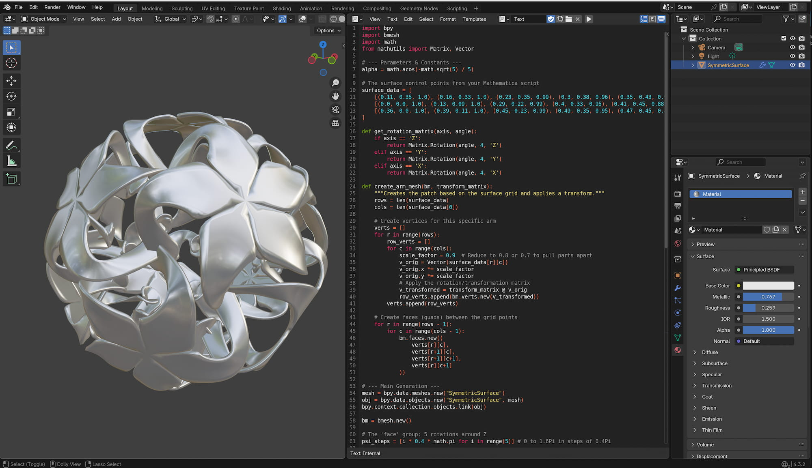

# Basheba Style

this little tools help you to build a "Basheba Style" object in a blender file. 

# Instruction

load the script in the blender txt environment, than press run and the object is build, this script could be a base for a future add-on. There are some few parameter inside, but i did not continue the development now

# Screen Shot

  

