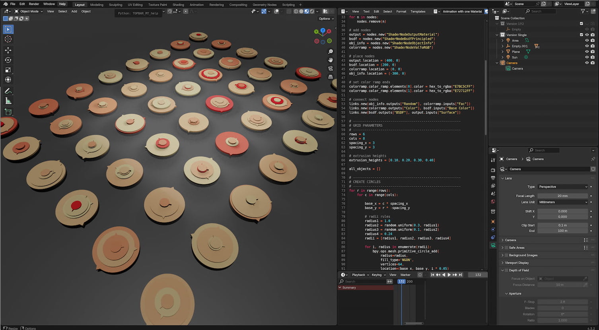

# Circle Animation
this little tools builds a funny cylinder animation. 

## Screenshot

  

## Instruction
load the script in the blender txt environment, in the script you can see the parameter. when you have the the desired parameter press run, and the animation will be created

### grid parameter
* rows = 6
* cols = 8
* spacing_x = 3
* spacing_y = 3

### extrusion heights parameter
extrusion_heights = [0.10, 0.20, 0.30, 0.40]

### set color ramp ends
* colorramp.color_ramp.elements[0].color = hex_to_rgba("E7BC5CFF")
* colorramp.color_ramp.elements[1].color = hex_to_rgba("E72712FF")

