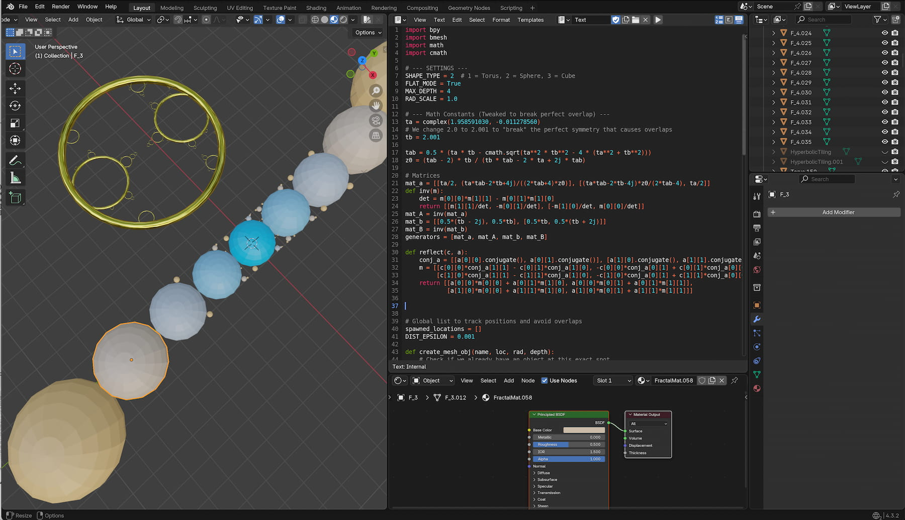

# Kleinian Trials

those 5 little scripts helping you to build kleinian fractals in blender in a couple of variations. 

# Background

Kleinian fractals are intricate geometric shapes formed by the limit sets of Kleinian groups, which are discrete groups of Möbius transformations acting on the complex plane or hyperbolic 3-space. Famous for their appearance in the book Indra's Pearls by David Mumford, Caroline Series, and David Wright, these patterns blend geometry, group theory, and complex numbers into stunning, infinitely detailed visualizations

# Instruction

load the script in the blender txt environment, than press run and the Apollonian Gasket is build. The little script could be a base for a later add-on to build such fractals.

# Screen Shot

  

