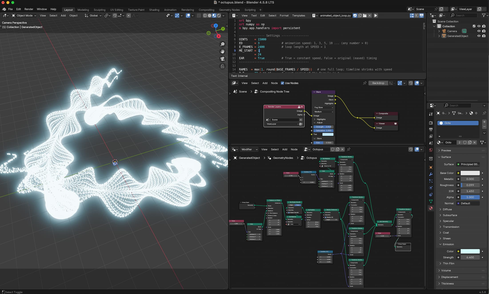

# Octopus Animation
this little tools builds a funny octopus Blender animation. 

## Screenshot

  

## Instruction
load the script in the blender txt environment, in the script you can see the parameter. when you have the the desired parameter press run, and the animation will be created.
if you like you can use Geometry Nodes as shown in the Screenshot to adjust Material and Point Cloud Parameter

### Parameters

* N_POINTS    	= 10000
* SPEED       	= 3             # animation speed: 1, 3, 5, 10 ... (any number > 0)
* BASE_FRAMES   = 2400          # loop length at SPEED = 1
* FRAME_START 	= 1
* FPS         	= 24
* LINEAR      	= True          # True = constant speed, False = original (eased) timing

### Video

  <a href="https://youtube.com">
    
     
    ▶️ <b>Short auf YouTube ansehen</b>
  </a>

