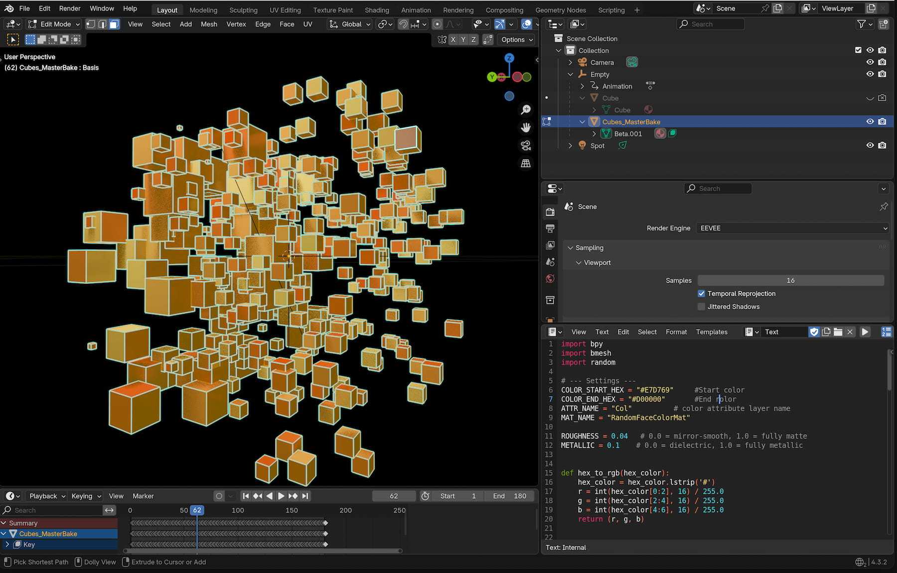

# Random Colors

this little tools help you to set colors randomly on all selected faces. 

## Instruction

load the script in the blender txt environment, in the script you can set a HEX Color Start value & a HEX color End value. 
Than go to your scene, switch to edit mode, select all object where you want to assign a random color, press run and all faces have different colors. 

## Screenshot

  

