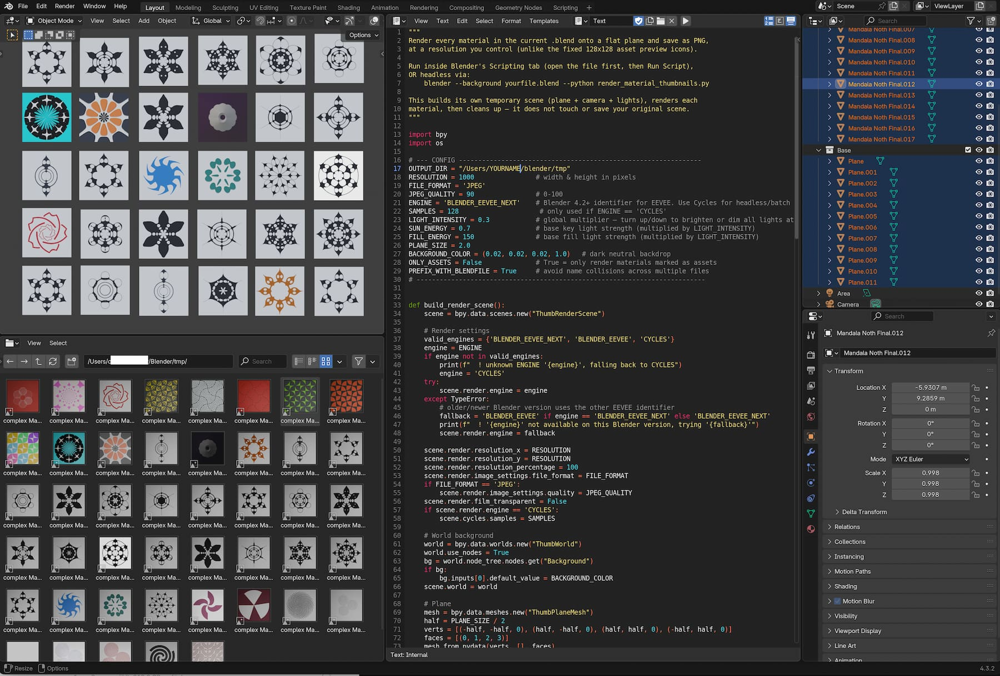

# Render Material Thumbnails

this little tools help you to make a mass render. 
it render all materials as flat images out in a certain directory. 

# Instruction

load the script in the blender txt environment, be sure that all your materials have a proper UV material connect socket. press run and all previews are going to be rendered in a blender tmp folder. 
check the settings in the begin of those files

important! set the path to your personal output render path! OUTPUT_DIR = "/Users/NAME/blender/tmp"

## Screenshot

  

