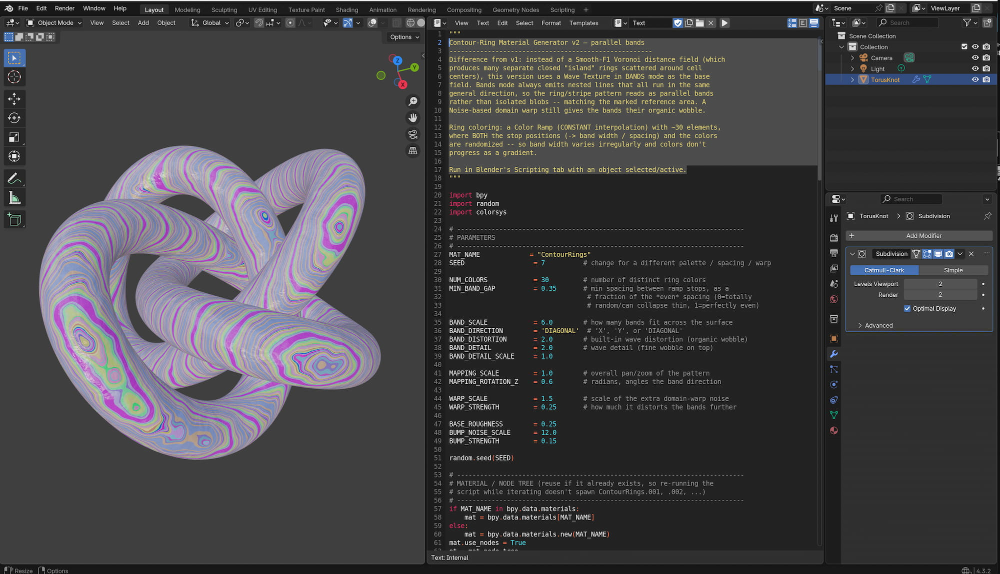

# Wave Material

this little tools help you to build a nice colorful wave material with python. It could already be an add-on because there are many parameter to adjust the material, but of course one could adjust them also later in the shader nodes. 

# Instruction

Contour-Ring Material Generator v2 — parallel bands
-----------------------------------------------------
Difference from v1: instead of a Smooth-F1 Voronoi distance field (which produces many separate closed "island" rings scattered around cell centers), this version uses a Wave Texture in BANDS mode as the base field. Bands mode always emits nested lines that all run in the same general direction, so the ring/stripe pattern reads as parallel bands rather than isolated blobs -- matching the marked reference area. A Noise-based domain warp still gives the bands their organic wobble. 
Ring coloring: a Color Ramp (CONSTANT interpolation) with ~30 elements, where BOTH the stop positions (-> band width / spacing) and the colors are randomized -- so band width varies irregularly and colors don't progress as a gradient.

Run in Blender's Scripting tab with an object selected/active.

#Screen Shot

  

